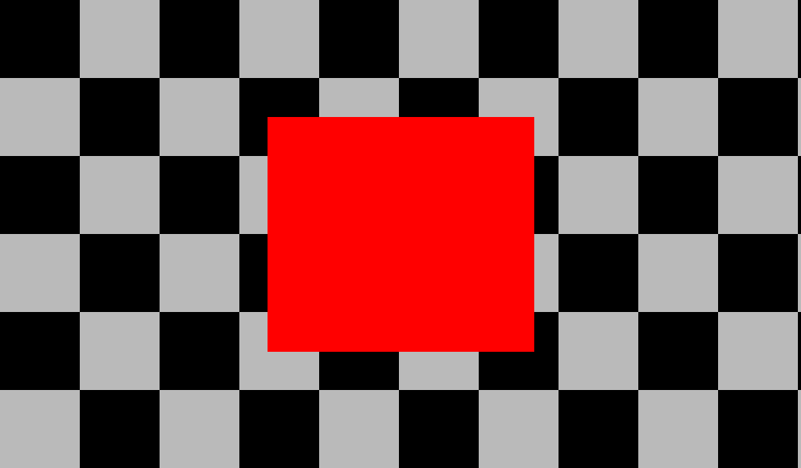
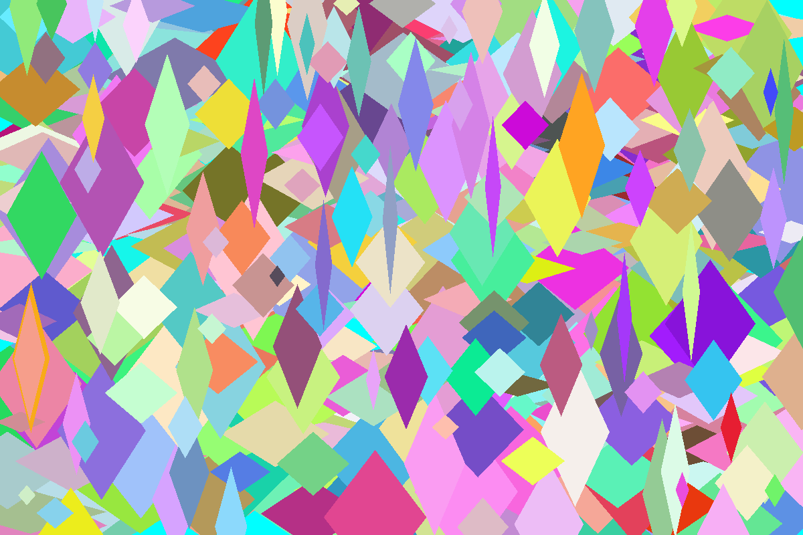
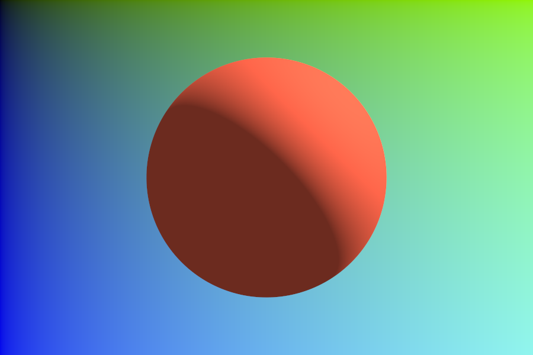
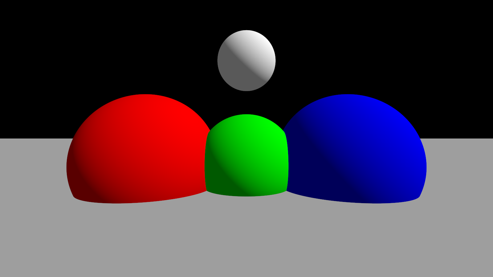
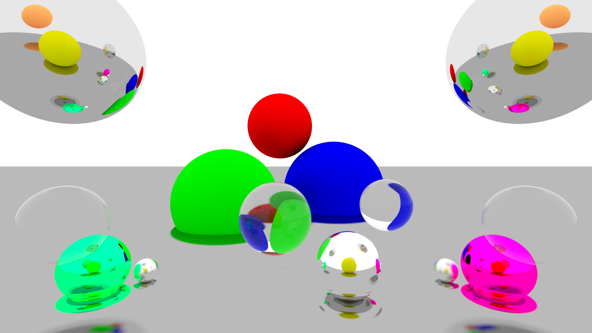
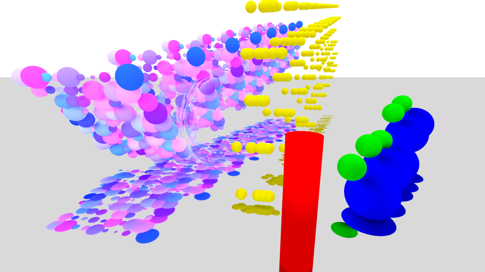
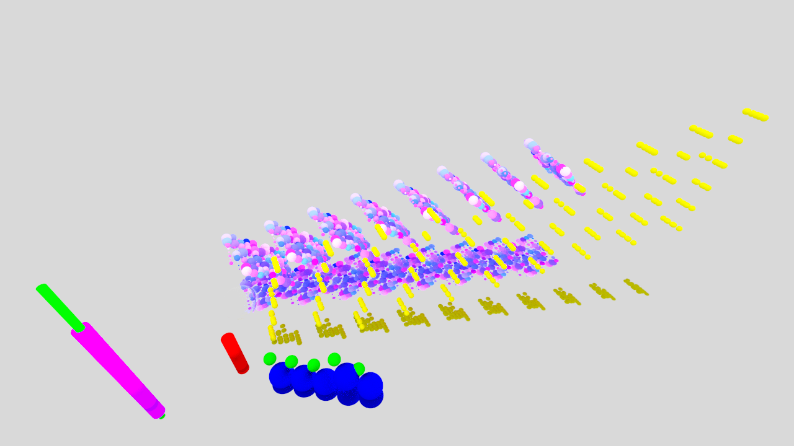
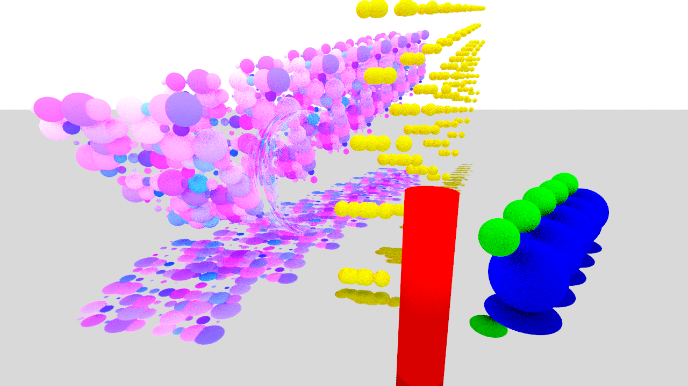
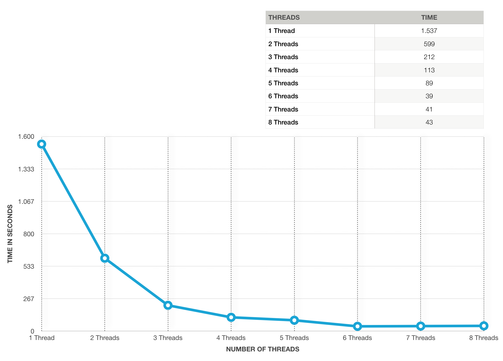
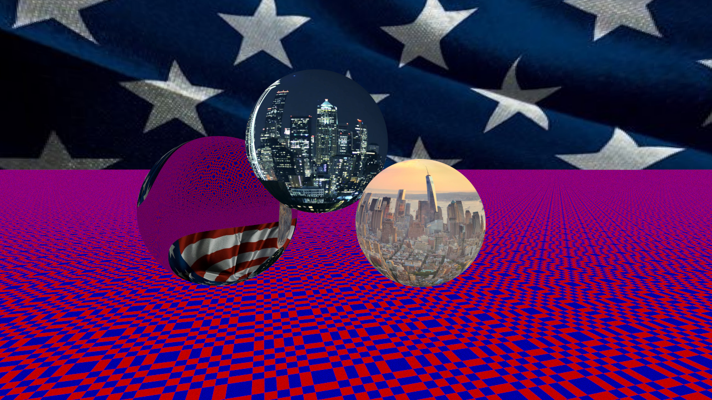

# Computer-Graphics
In the fifth semester of my Bachelor's degree studies at the Beuth University of Applied Sciences Berlin, I came in contact with computer graphics for the very first time.
  
Down below you will see my own implementation of a ray tracer in Java.
  
The course focused on the core elements of computer graphics, such as:
<ul>
    <li>RASTER GRAPHICS</li>
    <li>GAMMA CORRECTION AND ANTIALIASING</li>
    <li>RAYTRACING</li>
    <li>REFLECTION</li>
    <li>SHAPES LIKE CYLINDERS AND SPHERES</li>
    <li>GLASS AND METAL</li>
    <li>TRANSFORMATIONS</li>
    <li>SCENEGRAPH</li>
    <li>THREADS</li>
    <li>TEXTURES</li>
</ul>
  

    
    
    
    
    
    
    
    
    
    
    
    
    
    
    
    
    
    

 
